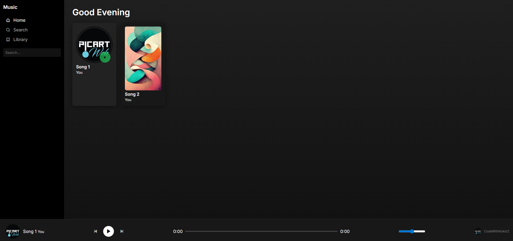

# 🎧 Musicly

<p align="center">
  A modern Spotify-inspired music player built with HTML, CSS, and JavaScript.
</p>

<p align="center">
  
  
  
  
</p>

---

## 📸 Preview

<p align="center">
  
</p>

---

## ✨ Features

- Spotify-inspired desktop layout
- Sidebar navigation
- Interactive song cards
- Hover play button
- Bottom music player
- Play / pause / next / previous controls
- Progress bar
- Volume control
- Search filtering
- Responsive structure for future expansion

---

## 🛠️ Built With

- **HTML5**
- **CSS3**
- **Vanilla JavaScript**

---

## 📂 Project Structure

```plaintext
musicly/
│
├── preview/
│   └── prev1.png
│
├── songs/
│   ├── cover1.jpg
│   ├── cover2.jpg
│   ├── song1.mp3
│   └── song2.mp3
│
├── index.html
├── style.css
├── script.js
├── README.md
└── LICENSE
```
